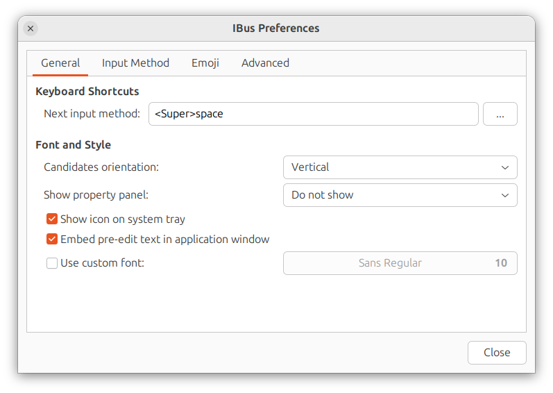

# লিনাক্স সিস্টেমে

লিনাক্স সিস্টেমে khipro-m17n দুই উপায়ে ব্যবহার করা যায়:

1. ibus-m17n দিয়ে। এক্ষেত্রে [টাইপিং বুস্টারও](https://mike-fabian.github.io/ibus-typing-booster/) ইনস্টল করা যাবে (টাইপিং বুস্টার একটি ইন্টেলিজেন্ট টাইপিং অ্যাসিস্ট্যান্ট। যেটাতে প্রিভিউ, সাজেশন, ও আরো বিভিন্ন ফিচার আছে)
2. fcitx5-m17n দিয়ে। fcitx \-এ আপাতত টাইপিং বুস্টার ব্যবহার করা যাচ্ছে না।

## ক্ষিপ্র m17n ইনস্টল করা

1. ক্ষিপ্র ইনস্টল করার আগে আইবাস ব্যবহারকারীরা `ibus-m17n` ইনস্টল করবেন এবং fcitx ব্যবহারকারীরা `fcitx5-m17n` ইনস্টল করবেন। আপনি যদি না জানেন এগুলো কী তবে আপনি অবশ্যই ibus চালাচ্ছেন; তাই `ibus-m17n` ইনস্টল করে নিন।
2. উবুন্টু, লিনাক্স মিন্ট এবং আরো কিছু ডিস্ট্রোতে বাংলার language pack আলাদা ভাবে ইনস্টল করতে হয়। Ubuntu-র ক্ষেত্রে “`Language Support`” অ্যাপটি ওপেন করে সেখান থেকে বাংলার জন্য ল্যাংগুয়েজ সাপোর্ট ইনস্টল করে নিন।  
   বাংলার জন্য ল্যাংগুয়েজ সাপোর্ট ইনস্টল করলেই বেশ কিছু ডিস্ট্রোতে `ibus-m17n` অটো ইনস্টল হয়ে যায়।  
   ল্যাংগুয়েজ সাপোর্টের মাধ্যমে বাংলার সাপোর্ট এবং `ibus-m17n` দুটোই ইনস্টল থাকাটা জরুরি। দুটোই ইনস্টল করা আছে কিনা নিশ্চিত করুন।
3. _(এই ধাপটি ঐচ্ছিক হলেও খুবই গুরুত্বপূর্ণ)_ এরপর [টাইপিং বুস্টার](https://mike-fabian.github.io/ibus-typing-booster/) ইনস্টল করে নিন। উবুন্টুতে `sudo apt install ibus-typing-booster` কমান্ড দিতে হবে। Fedora \-তে প্রি-ইনস্টল করা থাকার কথা। আপনি যদি fcitx ব্যবহারকারী হন তাহলে টাইপিং বুস্টার ব্যবহার করতে পারবেন না।
4. এরপরের কাজ, [khipro-m17n এর গিটহাব রিপোজিটরি](https://github.com/rank-coder/khipro-m17n) থেকে `bn-khipro.mim` ফাইলটি সিস্টেমের সঠিক জায়গায় রেখে দিতে হবে। এই কাজটি সহজে করতে নিচের কমান্ডটি টার্মিনালে রান করুন:
   ```bash
   sudo bash -c "$(curl -fsSL https://raw.githubusercontent.com/rank-coder/khipro-m17n/main/installer)"
   ```
   আপনার যদি আপনার কম্পিউটারে অ্যাডমিন অ্যাকসেস না থাকে তাহলে `sudo` কমান্ড কাজ করবে না। সেক্ষেত্রে `sudo` বাদ দিয়ে উপরের কমান্ডটি রান করুন। এক্ষেত্রে কেবল আপনার ইউজার অ্যাকাউন্টের জন্য ক্ষিপ্র ইনস্টল হবে।
5. এরপরে কম্পিউটার log out করে আবার log in করুন।
6. _(এই ধাপটি ঐচ্ছিক হলেও গুরুত্বপূর্ণ)_ এরপর টাইপিং বুস্টার কনফিগারেশনের পালা। টাইপিং বুস্টার ব্যবহারের সেরা অভিজ্ঞতা পাওয়ার জন্য [টাইপিং বুস্টারের কনফিগারেশন সংক্রান্ত সকল নির্দেশনা ও টিপস](/installation/typing_booster_configuration/) পৃষ্ঠায় আছে।
7. যারা টাইপিং বুস্টার ব্যতীত ক্ষিপ্র ব্যবহার করবেন তারা ক্ষিপ্র ইনস্টল করার পরে আপনার সিস্টেমের সেটিংস থেকে khipro-m17n -কে ইনপুট সোর্স হিসেবে অ্যাড করে নিন।  
আর যারা টাইপিং বুস্টারের মাধ্যমে ক্ষিপ্র ব্যবহার করবেন তারা টাইপিং বুস্টারকে ইনপুট সোর্স হিসেবে অ্যাড করুন।  
তারপরে সিস্টেমের ইনপুট মেথড কিংবা কিবোর্ড সংক্রান্ত সেটিংস থেকে টাইপিং বুস্টার সিলেক্ট করতে হবে। উবুন্টুতে নিচের ছবির মতো সেটিংস পাবেন Settings অ্যাপে। নিচের ছবি দ্রষ্টব্য...


> [!WARNING]  
আমরা টাইপিং বুস্টার ছাড়া ক্ষিপ্র ব্যবহার করা রেকমেন্ড করি না।  
তাছাড়া টাইপিং বুস্টার ইংরেজির জন্যও ইউস করা যায়।

যদি আপনার ডিস্ট্রোতে সিস্টেম সেটিংস থেকে আইবাসের সেটিংস কনফিগার করা না যায় তবে ibus-preferences থেকে কাজটি করতে হবে। অ্যাপ মেনু -তে `ibus preferences` নামে, অথবা টার্মিনালে `ibus-setup` কমান্ড দিয়ে লঞ্চ করতে পারবেন এবং সেখান থেকে টাইপিং বুস্টার কিংবা `khipro-m17n` সিলেক্ট করতে পারবেন। সেক্ষেত্রে নিচের ছবির মতো উইন্ডো আসবে।


### প্রি-রিলিস কিংবা টেস্টিং ভার্শন ইনস্টল করা

লিনাক্সে ক্ষিপ্র-র স্ট্যাবল রিলিস ছাড়াও প্রি-রিলিস ভার্শন ইনস্টল করে ট্রাই করতে পারবেন। এমনকি পুরাতন ভার্শনও ইনস্টল করতে পারবেন। সেটা করার জন্যও উপরের ইনস্টলেশন কমান্ডটি রান করে `Install stable release from the main branch? (Y/n): ` জিজ্ঞেস করা হলে `n` দিন। এবং ব্রাঞ্চের নাম জিজ্ঞেস করলে যেই ব্রাঞ্চ থেকে ইনস্টল করতে চান সেই ব্রাঞ্চের নাম দিন। এই উপায়ে টেস্টিং ব্রাঞ্চ থেকে কিংবা অন্য কোনো ব্রাঞ্চ থেকে কোনো ঝামেলা ছাড়াই ইনস্টল করা যাবে।


### আপডেট করা

আপডেট করাটা খুবই সোজা। [khipro-m17n এর রিলিস পেজে](https://github.com/rank-coder/khipro-m17n/releases) চেক করুন কোনো নতুন আপডেট এসেছে কিনা। নতুন আপডেট এসে থাকলে উপরে দেওয়া ইনস্টলেশনের কমান্ডটি দিয়েই আপডেট করা যাবে।

এরপর, কম্পিউটার লগআউট করে লগইন করুন।

### আনইনস্টল করা

আনইনস্টলেশন করতেও উপরের কমান্ড ব্যবহার করা যাবে। স্ক্রিপ্টটি রান হবার সময় আনইনস্টলেশন মোড সিলেক্ট করতে হবে।


কোনো প্রশ্ন থাকলে আমাদের সাথে যোগাযোগ করুন: https://khiproteam.github.io/khipro/#community