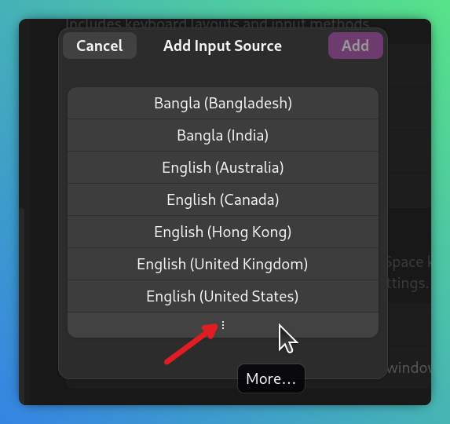
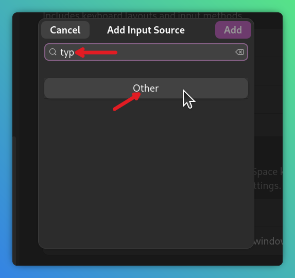
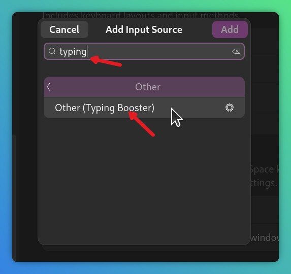
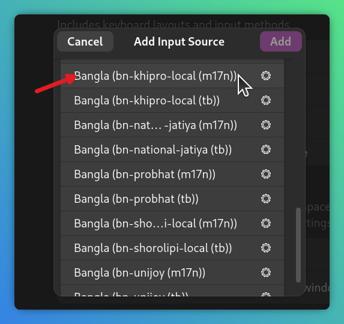
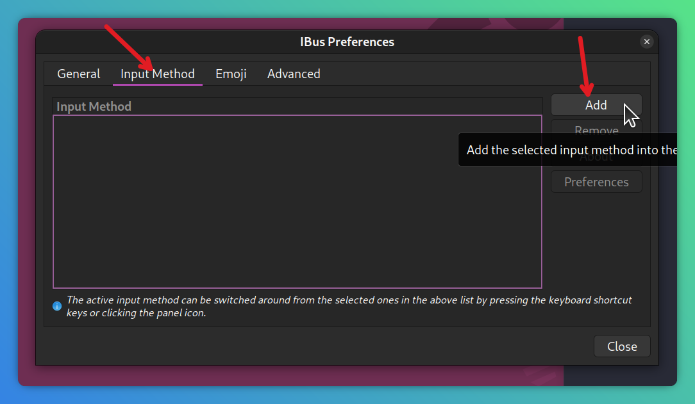
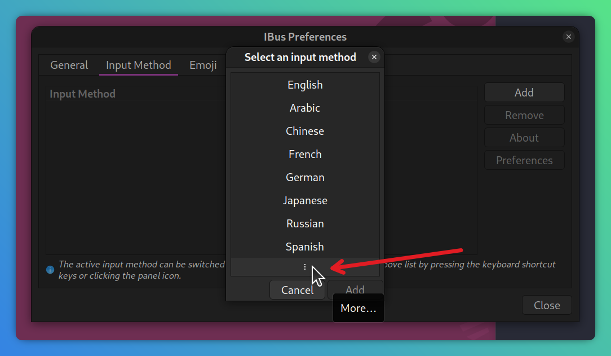
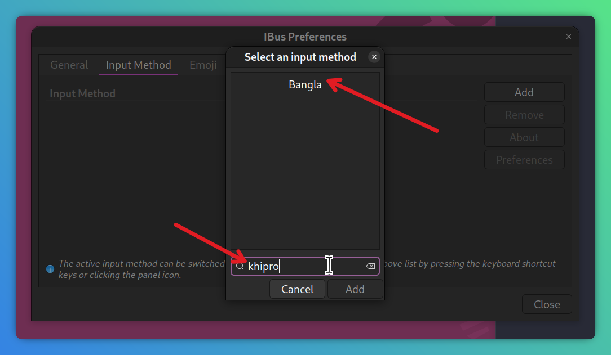
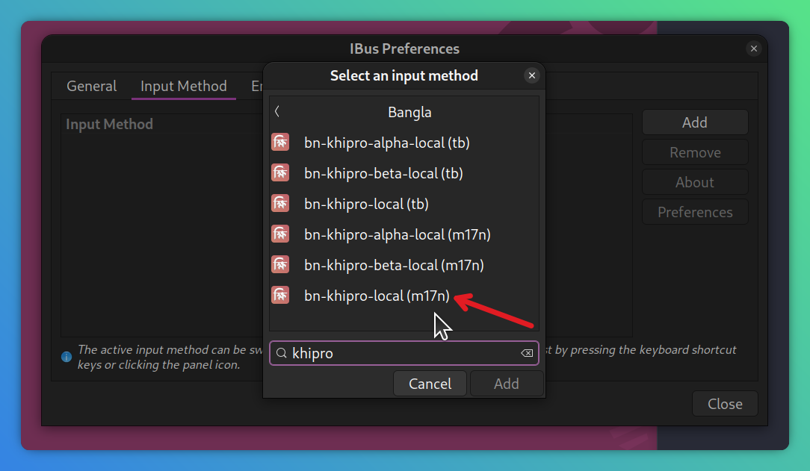

লিনাক্স সিস্টেমে khipro-m17n দুই উপায়ে ব্যবহার করা যায়:

1. **ibus-m17n দিয়ে:**  
এক্ষেত্রে টাইপিং বুস্টার দিয়ে ক্ষিপ্র ব্যবহার করা যাবে।
2. **fcitx5-m17n দিয়ে:**  
fcitx-এ টাইপিং বুস্টার ছাড়া ব্যবহার করতে হবে।

## ক্ষিপ্র ইনস্টলেশন

### **ল্যাংগুয়েজ সাপোর্ট চেক করা:**  
Ubuntu, Linux Mint এবং আরো কিছু ডিস্ট্রোতে বাংলার language pack আলাদা ভাবে ইনস্টল করতে হয়।  
Ubuntu-র ক্ষেত্রে “`Language Support`” অ্যাপটি ওপেন করে সেখান থেকে বাংলার জন্য ল্যাংগুয়েজ সাপোর্ট ইনস্টল করে নিন।  
বাংলার জন্য ল্যাংগুয়েজ সাপোর্ট ইনস্টল করলেই বেশ কিছু ডিস্ট্রোতে `ibus-m17n` অটো ইনস্টল হয়ে যায়।  

### **m17n ইনস্টল করা:**  
অনেক ডিস্ট্রোতেই m17n প্রি-ইনস্টল করা থাকে। যদি না থাকে তাহলে উবুন্টু, লিনাক্স মিন্ট, ও অন্যান্য ডেবিয়ানভিত্তিক ডিস্ট্রোতে নিচের কমান্ড দিয়ে ইনস্টল করা যাবে:
   ```bash
   sudo apt install ibus-m17n
   ```
> [!NOTE] আপনি fcitx ব্যবহারকারী হলে [এখানে ক্লিক করুন](#fcitxনির্দেশনা)। fcitx কী তা না জানলে ইগনোর করুন।   
### **ক্ষিপ্র ইনস্টল হয়েছে কিনা চেক করা:**  
এবার আপনার সিস্টেমের `m17n-db`, অর্থাৎ, m17n ডেটাবেজের ভার্শন চেক করুন। **উবুন্টুর** জন্য নিচের কমান্ড:
```bash
m17n-db --version
```
> [!WARNING]
> ফেডোরাতে উপরের কমান্ড বাই ডিফল্ট কাজ করে না। সেটা কাজ করানোর জন্য `m17n-db-devel` নামের একটা প্যাকেজ ইনস্টল করে নিতে হয় আগে।
   
যদি `Version 1.8.12` এর সমান কিংবা তার চেয়ে নতুন দেখায় তাহলে **ক্ষিপ্র বিল্ট-ইন** আছে। পরবর্তী ধাপে চলে যান।
কিন্তু পুরোনো ভার্শন হলে নিচের কমান্ড দিয়ে ক্ষিপ্র ডাউনলোড করতে হবে:
```bash
bash -c "$(curl -fsSL https://raw.githubusercontent.com/rank-coder/khipro-m17n/main/installer)"
```
> [!TIP] 
> যদি আপনার সিস্টেমে আপনার administrator অ্যাকসেস থাকে তাহলে আপনি উপরের কমান্ডটি নিচের মতো sudo মোডেও রান করতে পারেন:
   ```bash
   sudo bash -c "$(curl -fsSL https://raw.githubusercontent.com/rank-coder/khipro-m17n/main/installer)"
   ```

### রিফ্রেশ করা
এবার আইবাস রিফ্রেশ করে নিন:
   ```bash
   ibus restart
   ```

### **টাইপিং বুস্টার ইনস্টলেশন:**  
_(এই ধাপটি ঐচ্ছিক হলেও খুবই গুরুত্বপূর্ণ)_  
লিনাক্সে ক্ষিপ্র ব্যবহারের পূর্ণাঙ্গ আনন্দ পেতে হলে টাইপিং বুস্টার ইনস্টল করা উচিত। টাইপিং বুস্টার কী তা জানতে [এখানে ক্লিক করুন](/installation/typing-booster-configuration/)। উবুন্টুর মতো ডেবিয়ানভিত্তিক ডিস্ট্রোগুলোতে নিচের কমান্ড দিয়ে টাইপিং বুস্টার ইনস্টল করুন:
   ```bash
   sudo apt install ibus-typing-booster
   ```


### টাইপিং বুস্টারকে ইনপুট মেথড হিসেবে সিলেক্ট করা
উবুন্টুর ক্ষেত্রে, **Settings** > **Keyboard** > **Add Inpur Source** > **:** (More) সিলেক্ট করুন। নিচের ছবি দ্রষ্টব্য:  


`More...` সিলেক্ট করলে একটা সার্চ বার দেখা যাবে, সেখানে `typing booster` লিখে সার্চ করুন। নিচের ছবি দ্রষ্টব্য:  



`Other` সিলেক্ট করলে সেখানে `Typing Booster` দেখতে পাবেন। টাইপিং বুস্টারে ক্লিক করুন। নিচের ছবি দ্রষ্টব্য:  



### টাইপিং বুস্টার কনফিগার করা
এরপরে [টাইপিং বুস্টারের সেটিংগুলো](/installation/typing-booster-configuration/) সুন্দর করে সাজিয়ে নিন। এটা নিয়ে ছবিযুক্ত একটা ছোট্টো গাইড লিখেছি আমরা; পড়তে [এখানে ক্লিক করুন](/installation/typing-booster-configuration/)।

### টাইপিং বুস্টার ছাড়া ক্ষিপ্র

> [!WARNING]  
আমরা টাইপিং বুস্টার ছাড়া ক্ষিপ্র ব্যবহার করা রেকমেন্ড করি না।  
তাছাড়া টাইপিং বুস্টার ইংরেজি/বাংলা উভয়ের জন্য ইউস করা যায়।

যারা টাইপিং বুস্টার ছাড়া ক্ষিপ্র ব্যবহার করতে বদ্ধপরিকর, তারা সিস্টেমের (উবুন্টুর ক্ষেত্রে) **Settings** > **Keyboard** > **Add Input Source** থেকে `Bangla (bn-khipro(m17n))` অ্যাড করে নিন। tb সিলেক্ট করবেন না।  


> [!NOTE]
যদি আপনার ডিস্ট্রোতে সিস্টেম সেটিংস থেকে আইবাসের সেটিংস কনফিগার করা না যায় তবে ibus-preferences থেকে কাজটি করতে হবে। নিচে তার উপায় উল্লেখিত হলো:  

অন্যান্য ডিস্ট্রোর ক্ষেত্রে `ibus-preferences` টুল থেকে `bn-khipro(m17n)` অ্যাড করা যাবে।  
স্টার্ট মেনু থেকে টুলটি খুঁজে না পেলে `terminal`-এ নিচের কমান্ড রান করুন:

   ```bash
   ibus-setup
   ```

সেক্ষেত্রে নিচের ছবির মতো উইন্ডো আসবে।


- `Add` বাটনে ক্লিক করুন।
- এরপরে নিচের তিন ডট কিংবা `More` বাটনে ক্লিক করুন।  


- যেই সার্চবক্স দেখতে পাবেন সেখানে `khipro` লিখে সার্চ করুন।  

- `Bangla`-তে ক্লিক করুন।
- `bn-khipro (m17n)` সিলেক্ট করুন। tb সিলেক্ট করবেন না।  

- এরপরে হয় সিস্টেম লগআউট করুন, নাহয় নিচের কমান্ড দিয়ে আইবাস রিস্টার্ট করে নিন: 
   ```bash
   ibus restart
   ```

### fcitx5 ব্যবহারকারীদের জন্য নির্দেশনা
<a id="fcitxনির্দেশনা"></a>
- আপনার সিস্টেমে fcitx5-m17n ইনস্টল করা আছে কিনা নিশ্চিত করুন।
- প্রয়োজনে ইনস্টল করে আপডেট করে নিন।
- এরপরে উপরে বর্ণিত নিয়মে ক্ষিপ্র ইনস্টল করে নিন।
- এরপরে fcitx এর কনফিগারেশন মেনু থেকে Bangla (bn-khipro(m17n)) অ্যাড করে নিন।
- fcitx এর কনফিগারেশন মেনু ওপেন করতে নিচের কমান্ড রান করুন:  
   ```bash
   fcitx5-configtool
   ```

## আপডেট করা

- আপনি যদি আপনার ডিস্ট্রোতে বিল্ট-ইনভাবে দেওয়া (যেটা m17n-db -এর সাথে ইনস্টল হয়) ক্ষিপ্র ইউস করেন তাহলে আপনার সিস্টেম আপডেটের সাথে সাথেই ক্ষিপ্র-ও আপডেট হয়ে যাবে। আপনাকে কিছু করতে হবে না।  
- আগেও বলা হয়েছে, ডিস্ট্রোর বিল্ট-ইন ক্ষিপ্র-র ভার্শন একটু পেছনে থাকতে পারে।  
- আপডেটেড অথবা প্রি-রিলিস ভার্শনগুলো ইউস করতে ম্যানুয়ালি ক্ষিপ্র ডাউনলোড করতে হয়, আর সেগুলোর আপডেটও ম্যানুয়ালি করতে হয়।  
আপডেট করাটা খুবই সোজা।  
[khipro-m17n এর রিলিস পেজে](https://github.com/rank-coder/khipro-m17n/releases) চেক করুন কোনো নতুন আপডেট এসেছে কিনা।  

> [!TIP] আপনার ডিভাইসে আপডেট নোটিফিকেশন পেতে চাইলে [আপডেট নোটিফিকেশন সেটআপ](#আপডেটনোটিফিকেশন) করুন।

- নতুন আপডেট এসে থাকলে উপরে দেওয়া ইনস্টলেশনের কমান্ডটি দিয়েই আপডেট করা যাবে।  
আপনার সুবিধার্থে কমান্ডটি আরেকবার দেওয়া হলো:
```bash
bash -c "$(curl -fsSL https://raw.githubusercontent.com/rank-coder/khipro-m17n/main/installer)"
```

- এরপর, কম্পিউটার লগআউট করে লগইন করুন।


## আপডেট নোটিফিকেশন সেটআপ করা
<a id="আপডেটনোটিফিকেশন"></a>
যেকোনো RSS reader এ Feed adding option-এ এটা paste করুন https://github.com/rank-coder/khipro-m17n/releases.atom তাহলেই এই repository-র release-এ subscribe হয়ে যাবেন।  
এরপর যখনই কোনো নতুন release হয় তখন বা তার পরে যদি feed refresh করেন new release + release info পেয়ে যাবেন feed-এ।

### Android থেকে
[Read You](https://github.com/ReadYouApp/ReadYou) use করা যেতে পারে Android-এ RSS-এর জন্য।

## ক্ষিপ্র-র beta, pre-release ভার্শন টেস্টিংয়ের উদ্দেশ্যে ইনস্টল করা

লিনাক্সে ক্ষিপ্র-র স্ট্যাবল রিলিস ছাড়াও প্রি-রিলিস ভার্শন ইনস্টল করে ট্রাই করতে পারবেন। এমনকি পুরাতন ভার্শনও ইনস্টল করতে পারবেন।  
সেটা করার জন্যও উপরের ইনস্টলেশন কমান্ডটি রান করে `Install stable release from the main branch? (Y/n): ` জিজ্ঞেস করা হলে `n` দিন। এবং ব্রাঞ্চের নাম জিজ্ঞেস করলে যেই ব্রাঞ্চ থেকে ইনস্টল করতে চান সেই ব্রাঞ্চের নাম দিন।  
আপনার সুবিধার্থে কমান্ডটি আরেকবার দেওয়া হলো:
```bash
bash -c "$(curl -fsSL https://raw.githubusercontent.com/rank-coder/khipro-m17n/main/installer)"
```
এই উপায়ে টেস্টিং ব্রাঞ্চ থেকে কিংবা অন্য কোনো ব্রাঞ্চ থেকে কোনো ঝামেলা ছাড়াই ইনস্টল করা যাবে।


## আনইনস্টল করা

আনইনস্টলেশন করতেও উপরের কমান্ড ব্যবহার করা যাবে।  
স্ক্রিপ্টটি রান হবার সময় আনইনস্টলেশন মোড সিলেক্ট করতে হবে।  
আপনার সুবিধার্থে কমান্ডটি আরেকবার দেওয়া হলো:
```bash
bash -c "$(curl -fsSL https://raw.githubusercontent.com/rank-coder/khipro-m17n/main/installer)"
```

কোনো প্রশ্ন থাকলে আমাদের সাথে যোগাযোগ করুন: https://khiproteam.github.io/khipro/#community