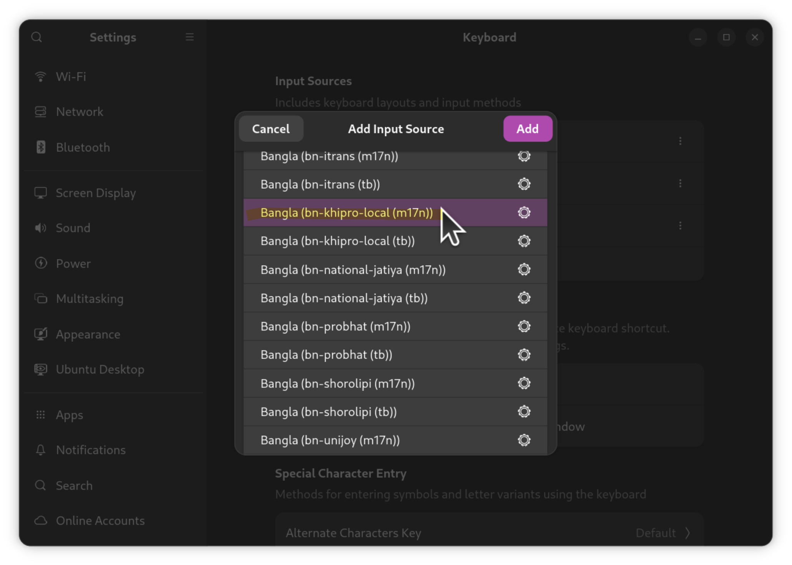

# লিনাক্স সিস্টেমে

লিনাক্স সিস্টেমে khipro-m17n দুই উপায়ে ব্যবহার করা যায়:

1. **ibus-m17n দিয়ে:**  
এক্ষেত্রে টাইপিং বুস্টার দিয়ে ক্ষিপ্র ব্যবহার করা যাবে।
2. **fcitx5-m17n দিয়ে:**  
fcitx -এ টাইপিং বুস্টার ছাড়া ব্যবহার করতে হবে।

## ক্ষিপ্র ইনস্টলেশন

### **ল্যাংগুয়েজ সাপোর্ট চেক করা:**  
Ubuntu, Linux Mint এবং আরো কিছু ডিস্ট্রোতে বাংলার language pack আলাদা ভাবে ইনস্টল করতে হয়।  
Ubuntu-র ক্ষেত্রে “`Language Support`” অ্যাপটি ওপেন করে সেখান থেকে বাংলার জন্য ল্যাংগুয়েজ সাপোর্ট ইনস্টল করে নিন।  
   বাংলার জন্য ল্যাংগুয়েজ সাপোর্ট ইনস্টল করলেই বেশ কিছু ডিস্ট্রোতে `ibus-m17n` অটো ইনস্টল হয়ে যায়।  

### **m17n ইনস্টল করা:**  
অনেক ডিস্ট্রোতেই m17n প্রি-ইনস্টল করা থাকে। যদি না থাকে তাহলে উবুন্টু, লিনাক্স মিন্ট, ও অন্যান্য ডেবিয়ানভিত্তিক ডিস্ট্রোতে নিচের কমান্ড দিয়ে ইনস্টল করা যাবে:
   ```bash
   sudo apt install ibus-m17n
   ```
> [!NOTE] আপনি fcitx ব্যবহারকারী হলে [এখানে ক্লিক করুন](#fcitxনির্দেশনা)। fcitx কী তা না জানলে ইগনোর করুন।   
### **ক্ষিপ্র ইনস্টল হয়েছে কিনা চেক করা:**  
এবার আপনার সিস্টেমের `m17n-db`, অর্থাৎ, m17n ডেটাবেজের ভার্শন চেক করুন:
```bash
m17n-db --version
```
   
যদি `Version 1.8.12` এর উপরে/বেশি দেখায় তাহলে **ক্ষিপ্র বিল্ট-ইন** আছে। পরের ধাপে চলে যান।
তবে আগের ভার্শন হলে নিচের কমান্ড দিয়ে ক্ষিপ্র ডাউনলোড করতে হবে:
```bash
bash -c "$(curl -fsSL https://raw.githubusercontent.com/rank-coder/khipro-m17n/main/installer)"
```
> [!TIP] 
> যদি আপনার সিস্টেমে আপনার administrator অ্যাকসেস থাকে তাহলে আপনি উপরের কমান্ডটি নিচের মতো sudo মোডেও রান করতে পারেন:
   ```bash
   sudo bash -c "$(curl -fsSL https://raw.githubusercontent.com/rank-coder/khipro-m17n/main/installer)"
   ```

### রিফ্রেশ করা
এবার আইবাস রিফ্রেশ করে নিন:
   ```bash
   ibus restart
   ```

### **টাইপিং বুস্টার ইনস্টলেশন:**  
_(এই ধাপটি ঐচ্ছিক হলেও খুবই গুরুত্বপূর্ণ)_  
লিনাক্সে ক্ষিপ্র ব্যবহারের পূর্ণাঙ্গ আনন্দ পেতে হলে টাইপিং বুস্টার ইনস্টল করা উচিত। টাইপিং বুস্টার কী তা জানতে [এখানে ক্লিক করুন](/installation/typing-booster-configuration/)। উবুন্টুর মতো ডেবিয়ানভিত্তিক ডিস্ট্রোগুলোতে নিচের কমান্ড দিয়ে টাইপিং বুস্টার ইনস্টল করুন:
   ```bash
   sudo apt install ibus-typing-booster
   ```
   এরপরে [টাইপিং বুস্টারের সেটিংগুলো](/installation/typing-booster-configuration/) সুন্দর করে সাজিয়ে নিন। এটা নিয়ে ছবিযুক্ত একটা ছোট্টো গাইড লিখেছি আমরা; পড়তে [এখানে ক্লিক করুন](/installation/typing-booster-configuration/)।

### টাইপিং বুস্টার ছাড়া ক্ষিপ্র:
যারা টাইপিং বুস্টার ছাড়া ক্ষিপ্র ব্যবহার করতে বদ্ধপরিকর, তারা সিস্টেমের **Settings** > **Keyboard** > **Add Inpur Source** থেকে `Bangla (bn-khipro(m17n))` অ্যাড করে নিন।  


> [!WARNING]  
আমরা টাইপিং বুস্টার ছাড়া ক্ষিপ্র ব্যবহার করা রেকমেন্ড করি না।  
তাছাড়া টাইপিং বুস্টার ইংরেজি/বাংলা উভয়ের জন্য ইউস করা যায়।

> [!NOTE]
যদি আপনার ডিস্ট্রোতে সিস্টেম সেটিংস থেকে আইবাসের সেটিংস কনফিগার করা না যায় তবে ibus-preferences থেকে কাজটি করতে হবে। নিচে তার উপায় উল্লেখিত হলো:

 অ্যাপ মেনু -তে `ibus preferences` নামে, অথবা টার্মিনালে `ibus-setup` কমান্ড দিয়ে লঞ্চ করতে পারবেন এবং সেখান থেকে টাইপিং বুস্টার কিংবা `khipro-m17n` সিলেক্ট করতে পারবেন। সেক্ষেত্রে নিচের ছবির মতো উইন্ডো আসবে।


### আপডেট করা

আপডেট করাটা খুবই সোজা।  
[khipro-m17n এর রিলিস পেজে](https://github.com/rank-coder/khipro-m17n/releases) চেক করুন কোনো নতুন আপডেট এসেছে কিনা।  
নতুন আপডেট এসে থাকলে উপরে দেওয়া ইনস্টলেশনের কমান্ডটি দিয়েই আপডেট করা যাবে।  
আপনার সুবিধার্থে কমান্ডটি আরেকবার দেওয়া হলো:
```bash
bash -c "$(curl -fsSL https://raw.githubusercontent.com/rank-coder/khipro-m17n/main/installer)"
```

এরপর, কম্পিউটার লগআউট করে লগইন করুন।

<a id="fcitxনির্দেশনা"></a>
### fcitx5 ব্যবহারকারীদের জন্য নির্দেশনা
- আপনার সিস্টেমে fcitx5-m17n ইনস্টল করা আছে কিনা নিশ্চিত করুন।
- প্রয়োজনে ইনস্টল করে আপডেট করে নিন।
- এরপরে উপরে বর্ণিত নিয়মে ক্ষিপ্র ইনস্টল করে নিন।
- এরপরে fcitx এর কনফিগারেশন মেনু থেকে Bangla (bn-khipro(m17n)) অ্যাড করে নিন।

### ক্ষিপ্র-র beta, pre-release ভার্শন টেস্টিংয়ের উদ্দেশ্যে ইনস্টল করা

লিনাক্সে ক্ষিপ্র-র স্ট্যাবল রিলিস ছাড়াও প্রি-রিলিস ভার্শন ইনস্টল করে ট্রাই করতে পারবেন। এমনকি পুরাতন ভার্শনও ইনস্টল করতে পারবেন।  
সেটা করার জন্যও উপরের ইনস্টলেশন কমান্ডটি রান করে `Install stable release from the main branch? (Y/n): ` জিজ্ঞেস করা হলে `n` দিন। এবং ব্রাঞ্চের নাম জিজ্ঞেস করলে যেই ব্রাঞ্চ থেকে ইনস্টল করতে চান সেই ব্রাঞ্চের নাম দিন।  
আপনার সুবিধার্থে কমান্ডটি আরেকবার দেওয়া হলো:
```bash
bash -c "$(curl -fsSL https://raw.githubusercontent.com/rank-coder/khipro-m17n/main/installer)"
```
এই উপায়ে টেস্টিং ব্রাঞ্চ থেকে কিংবা অন্য কোনো ব্রাঞ্চ থেকে কোনো ঝামেলা ছাড়াই ইনস্টল করা যাবে।


### আনইনস্টল করা

আনইনস্টলেশন করতেও উপরের কমান্ড ব্যবহার করা যাবে।  
স্ক্রিপ্টটি রান হবার সময় আনইনস্টলেশন মোড সিলেক্ট করতে হবে।  
আপনার সুবিধার্থে কমান্ডটি আরেকবার দেওয়া হলো:
```bash
bash -c "$(curl -fsSL https://raw.githubusercontent.com/rank-coder/khipro-m17n/main/installer)"
```

কোনো প্রশ্ন থাকলে আমাদের সাথে যোগাযোগ করুন: https://khiproteam.github.io/khipro/#community