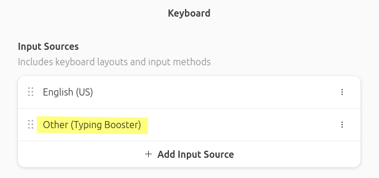
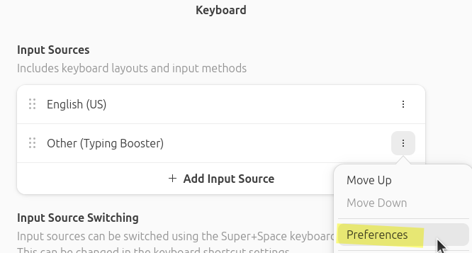
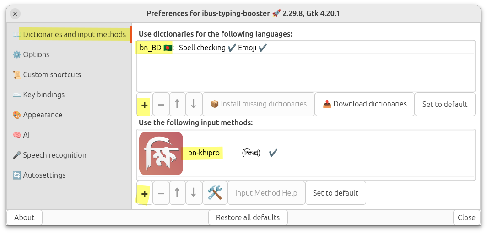
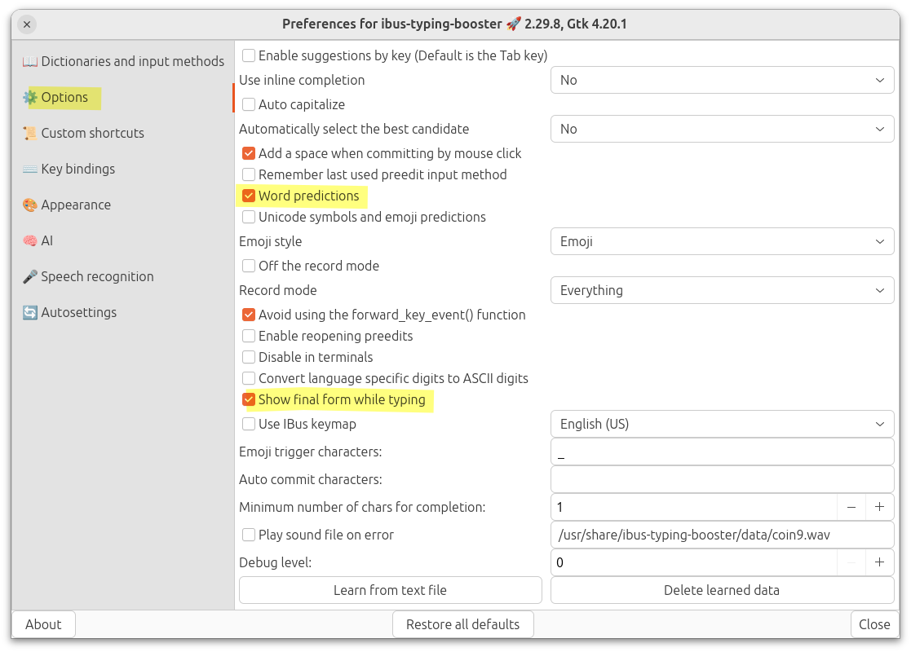
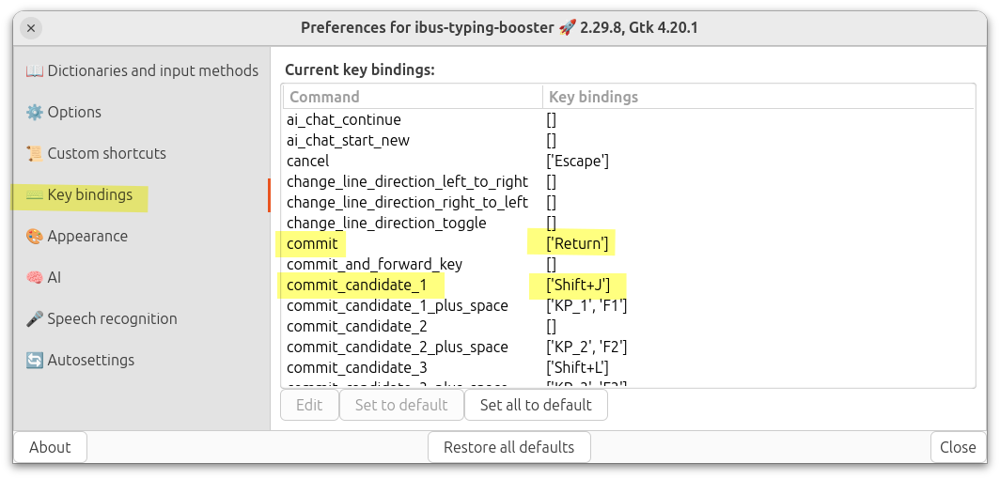
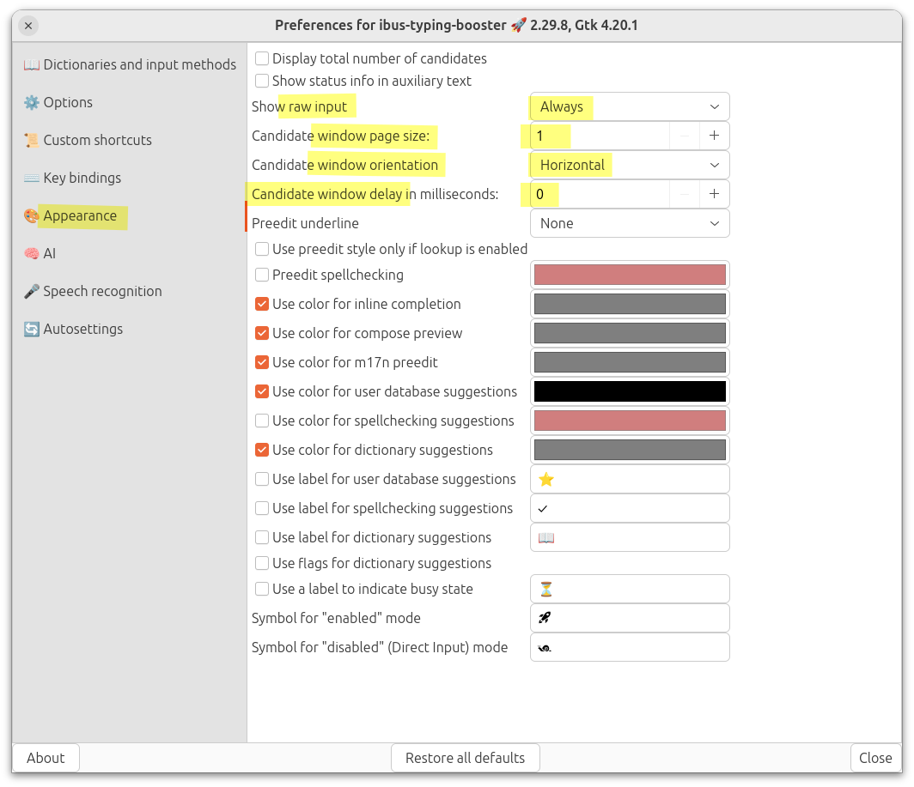

## টাইপিং বুস্টার কী?
<a href="https://mike-fabian.github.io/ibus-typing-booster/" target="_blank" rel="noopener noreferrer">টাইপিং বুস্টার</a> একটি ইন্টেলিজেন্ট টাইপিং অ্যাসিসটেন্ট। এতে অনেক ফিচার রয়েছে, যেমন:  
- আপনার লেখার অভ্যাসের উপর ভিত্তি করে next word suggestion অর্থাৎ পরবর্তী শব্দ অনুমান করে সাজেশন দিতে পারবে।  
- ডিকশনারি থাকায় লেখার সময় বানানের সাজেশন পাওয়া যাবে।
- ম্যানুয়ালি কোনো ডকুমেন্ট ইনপুট দিয়ে ট্রেইন করানো যায়।

## টাইপিং বুস্টার কনফিগার করা
<a href="https://mike-fabian.github.io/ibus-typing-booster/" target="_blank" rel="noopener noreferrer">টাইপিং বুস্টার</a> ইনস্টল করা হয়ে গেলে এরপর কম্পিউটার লগ আউট করে আবার লগ ইন করতে হবে।  
তারপরে সিস্টেমের ইনপুট মেথড কিংবা কিবোর্ড সংক্রান্ত সেটিংস থেকে <a href="https://mike-fabian.github.io/ibus-typing-booster/" target="_blank" rel="noopener noreferrer">টাইপিং বুস্টার</a> সিলেক্ট করতে হবে। উবুন্টুতে নিচের ছবির মতো সেটিংস পাবেন Settings অ্যাপে। নিচের ছবি দ্রষ্টব্য...

  

যদি আপনার ডিস্ট্রোতে সেটিংস থেকে আইবাসের সেটিংস কনফিগার করা না যায় তবে ibus-preferences থেকে কাজটি করতে হবে। অ্যাপ মেনু -তে `ibus preferences` নামে, অথবা টার্মিনালে `ibus-setup` কমান্ড দিয়ে লঞ্চ করতে পারবেন এবং সেখান থেকে <a href="https://mike-fabian.github.io/ibus-typing-booster/" target="_blank" rel="noopener noreferrer">টাইপিং বুস্টার</a> কিংবা `khipro-m17n` সিলেক্ট করতে পারবেন।

তারপরে সেখান থেকে <a href="https://mike-fabian.github.io/ibus-typing-booster/" target="_blank" rel="noopener noreferrer">টাইপিং বুস্টার</a>ের preferences কিংবা সেটিংসে যেতে হবে। নিচের ছবি দ্রষ্টব্য...

  

<a href="https://mike-fabian.github.io/ibus-typing-booster/" target="_blank" rel="noopener noreferrer">টাইপিং বুস্টার</a>ের সেটিংস ওপেন হলে প্রথমেই দেখা যাবে "Dictionaries & Input Methods" ট্যাব। সেখান থেকে বাংলার জন্য **একটা ডিকশনারি** সিলেক্ট করতে হবে। বাংলার জন্য তিনটা ডিকশনারি পাবেন; যেকোনো একটি সিলেক্ট করলেই হবে।  
এরপর <a href="https://mike-fabian.github.io/ibus-typing-booster/" target="_blank" rel="noopener noreferrer">টাইপিং বুস্টার</a>ের মধ্যেই **ইনপুট মেথড** হিসেবে ক্ষিপ্রকে সিলেক্ট করতে হবে এবং অন্যান্য ইনপুট মেথড রিমুভ করতে পারেন। নিচের ছবি দ্রষ্টব্য...

  

এরপরে "Options" ট্যাবে গিয়ে সেখান থেকে:
1. `Show final form while typing` এটা অবশ্যই চালু করে দিতে হবে।
2. `Word predictions`-ও চালু করে দিতে পারেন।

  

> [!IMPORTANT]  
 "Avoid using the forward_key_event() function" এটাতে টিকচিহ্ন ✓ দিতে হবে যদি <a href="https://mike-fabian.github.io/ibus-typing-booster/" target="_blank" rel="noopener noreferrer">টাইপিং বুস্টার</a>ে কমিট করার সময় হঠাৎ একা একা ইনসার্শন পয়েন্টার (insertion pointer) নড়ে যাওয়ার ইশুর সম্মুখীন হন। নাহলে দরকার নেই।

এরপরে "Keybindings" ট্যাবে যেতে হবে। সেখানে:
1. Commit এর জন্য Enter, 
2. Commit-candidate-1 এর জন্য কিবোর্ডের Shift+J সেট করুন। 
3. commit-candidate-1-plus-space এই কিবাইন্ডিংয়ের কোনো দরকার নেই। কারণ হলো বাংলার জন্য সাজেশন কমিট করার পর স্পেস যুক্ত হওয়াটা ভালো না। বাংলায় বিভক্তি, কিংবা দুই শব্দ জোড়া দিয়ে লিখতে হতে পারে।  
এডিট করা হলে কিছুটা নিচের ছবির মতো দাঁড়াবে:

  

প্রথম সাজেশনটাকে কমিট করার জন্য shift+J সেট করছি যাতে মূল কিবোর্ড থেকে হাত না সরিয়ে সাজেশন সিলেক্ট করা যায়।

এরপরে আমাদের কাজ "**Appearance**" ট্যাবে। এখানে:
1. `Show raw input` এটা চালু রাখুন। নতুবা আপনি কোন key-sequence এর জন্য ক্ষিপ্রতে কোন আউটপুট পাচ্ছেন সেটা দেখতে পাবেন না। এখানে `Always` সেট করুন।  
অবশ্য আমি ব্যক্তিগতভাবে এখানে `Never` রাখি লেখার গতি বাড়াতে ও মনোযোগ ধরে রাখতে।
2. `Candidate window page size` এর মান `1` রাখছি। কারণ আমার মতে সাজেশন একটা থাকলেই যথেষ্ট। তবে আপনি বেশি রাখতে পারেন।
3. `Candidate window delay` এটা অবশ্যই `0` রাখবেন নতুবা ক্যান্ডিডেট উইন্ডো দেরিতে আসবে আর এতে আপনার টাইপিংও স্লো হতে পারে।
3. `Candidate window orientation` আমি `horizontal` রাখছি।

নিচের ছবি দ্রষ্টব্য...

কোনো প্রশ্ন থাকলে আমাদের সাথে যোগাযোগ করুন: https://khiproteam.github.io/khipro/#community
