## এক নজরে ক্ষিপ্র লেআউট


## ক্ষিপ্র কিবোর্ডের বিশেষত্ব
প্রচলিত ফোনেটিক হোক কিংবা ফিক্সড লেআউট হোক, উভয় ধরনের লেআউটের চেয়েই ক্ষিপ্র-তে দ্রুত লেখা যায়। ক্ষিপ্রর প্রধান আকর্ষণ যে ফিচারগুলো, সেগুলো হলো:
1. Precisely যেকোনো কিছু লেখার ফ্লেক্সিবিলিটি দেওয়া। যা লিখতে চাই তাই লিখতে পারবো, ঠিক-ভুল বানানের প্যারা নাই, আবার সাজেশন (Suggestion) নির্ভরতা বিন্দুমাত্র নেই।
2. সকল বাটন মূল qwerty কিবোর্ডের মধ্যেই রাখা, যাতে নম্বর সারি কিংবা ব্র্যাকেট ব্যবহার না করা লাগে। এতে লেখার গতি যেমন বাড়বে, তেমনে কিবোর্ডে একটা key-ও ব্লক করবে না ক্ষিপ্র।
3. Shift key -এর ব্যবহার না মোটেই না করা। এতে লেখার গতি তো বাড়বেই; পাশাপাশি, ম্যাপিং মনে রাখা হয়ে যাবে পানির মতো সোজা।
4. এমন কিছু নেই যেটা ফিক্সড/ইনস্ক্রিপ্টে লেখা যায়, কিন্তু ক্ষিপ্র-তে লেখা যায় না। নুকতা (়), দ্বিদন্ড (॥), অবগ্রহ (ঽ), সব কিছু লেখা যাবে; আর হ্যাঁ, অবশ্যই মূল qwerty কিবোর্ড থেকে হাত না সরিয়ে।
5. স্লাইসার বলে এক অভিনব ফাংশন key আনা হয়েছে, যেটা হলো আপনার কিবোর্ডেরই স্ল্যাশ (/) key-টি। যেমন: ভুলে ক্ত লেখার পর '/' চাপলে যুক্তবর্ণ ভেঙে 'কত' হয়ে যাবে। তাই বারবার ব্যাকস্পেস চাপার দরকার থাকছে না আর।
6. একই ভাবে শব্দের মাঝে/শেষে কারচিহ্ন বসাতেও এখন আর ব্যাকস্পেস লাগবে না। স্বরবর্ণ লিখে মডিফায়ার চাপ দিলেই সেটা কারচিহ্ন হয়ে যাবে (যেমন, ই ⇔ ি)। আর মডিফায়ারও অবশ্যই মূল qwerty অংশের ভিতরেই রেখেছি।
7. বিশেষভাবে উল্লেখ্য ক্ষিপ্র-র এক্সট্রা স্বরবর্ণগুলো। অ্যা (ae), ওয়া (wa), ওয়ে (we), ওয়্যা (wae), এগুলোকে এক্সট্রা স্বরবর্ণ হিসেবে ক্ষিপ্রতে অ্যাড করা হয়েছে। তাই, র‍্যাম, সোয়েটার, সফটওয়্যার, শোয়া, এমন শব্দ দ্রুত ও সহজে লেখা যাবে।

মাত্র ৮টি সহজ ধাপে *ক্ষিপ্র*-র শক্তিশালী ফিচারগুলো ব্যবহার করা শিখে ফেলুন...

## লাইভ টাইপিং ডেমো
Banlga-IM এ ক্ষিপ্র ইনস্টল করা ছাড়াই ওয়েব ব্রাউজারে ক্ষিপ্র ট্রায়াল দিতে পারবেন। 

> [!WARNING]
> লাইভ টাইপিং ডেমো ব্যবহারের আগে অবশ্যই এই কুইকস্টার্ট গাইডটি ভালোমতো পড়ে নিন।

ট্রাই করতে <a href="https://www.nabilsnigdho.dev/bangla-im/" class="btn">ক্লিক করুন</a>

## ধাপ ১: সাধারণ বর্ণ লেখা
অধিকাংশ বর্ণকে কাছাকাছি উচ্চারণের ইংরেজি বর্ণ দিয়ে লেখা যাবে।\
যেমন:
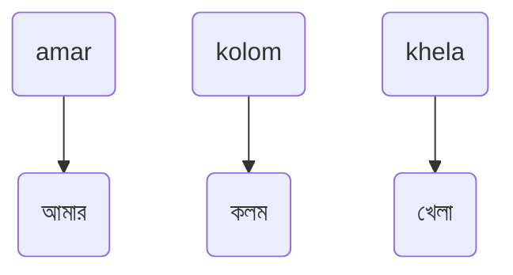
> [!IMPORTANT]
> `আ` লিখতে `a`, এবং, `এ` লিখতে `e` ব্যবহার করা হয়।

> [!NOTE]
> `অ্যা` ধ্বনি লেখার একটি বিশেষ ব্যবস্থা _ক্ষিপ্র_ -তে রয়েছে যেটা পরে উল্লেখ করা হবে।

**নিচের বর্ণগুলোকে হুবহু উচ্চারণ অনুসারে কিংবা, বিভিন্ন ফোনেটিক মেথডের অনুরূপ উপায়ে _ক্ষিপ্র_-তেও লেখা যায়:**

    
||||||
|:-:|:-:|:-:|:-:|:-:|
| অ | আ, -া | ই, -ি | উ, -ু | এ, -ে | 
| o | a    | i    | u    | e    |


|    |  |    |   |   |   |   |
|:-:|:-:|:-:|:-:|:-: |:-:|:-:|
| ক | খ | গ | ঘ | ঙ | চ | ছ |
| k | kh| g | gh| ng | c | ch |


|   |   |  |  |  |  |  |
|:-:|:-:|:---:|:---:|:---:|:---:|:---:|
| জ | ঝ | ত | থ | দ | ধ | ন |
| j | jh | t | th| d | dh| n |


|  |  |  |  |  |  |  |
|:---:|:---:|:---:|:---:|:---:|:---:|:---:|
| প | ফ | ব | ভ | ম | য | র |
| p | ph| b | v | m | z | r |


| |  |  |  |  |
|:---:|:---:|:---:|:---:|:---:|
| ল | শ | স | হ | য় |
| l | sh | s | h | y | 


এসব বর্ণ দিয়ে আরো কিছু সহজ ও কমন উদাহরণ:  

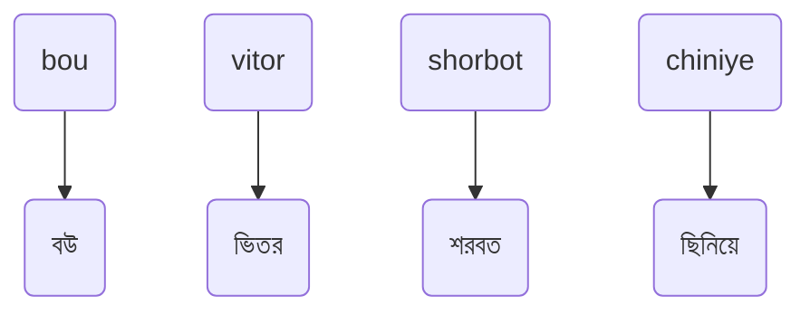

## ধাপ ২: অন্যান্য স্বরবর্ণ লেখা
কিছু স্বরবর্ণ লেখার জন্য ক্ষিপ্রতে ব্যতিক্রম ম্যাপিং ব্যবহার করা হয়। যেমন:

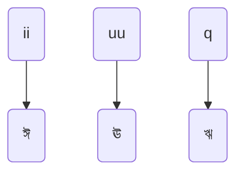

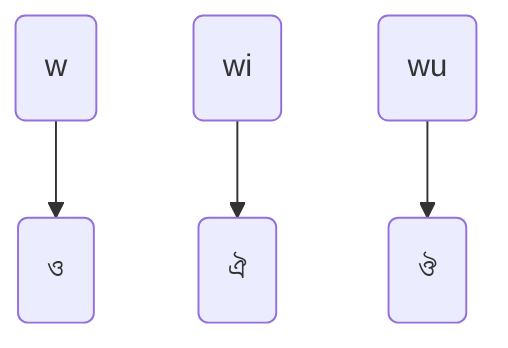

> [!NOTE]
> `wi` = `ঐ`, `wu` = `ঔ` নির্ধারণ করায় এসব শব্দ লিখতে সুবিধা হবে: `boi` = `বই`, `bou` = `বউ`

পূর্ণাঙ্গ ডকুমেন্টেশনে এই বিষয়ে বিশদে আলোচনা করা হয়েছে। এ বিষয়ে সবটা জানতে ক্লিক করুন।

## ধাপ ৩: ক্ষিপ্র-র এক্সক্লুসিভ স্বরবর্ণগুলো লেখা
ক্ষিপ্র-তে বাড়তি কিছু বর্ণগুচ্ছকে স্বরবর্ণ হিসেবে মর্যাদা দেওয়া হয় বা ট্রিট করা হয়। এটা ক্ষিপ্র-র আরেকটি শক্তিশালী ফিচার। 
এরকম চারটি বাড়তি স্বরবর্ণ তৈরি করা হয়েছে:

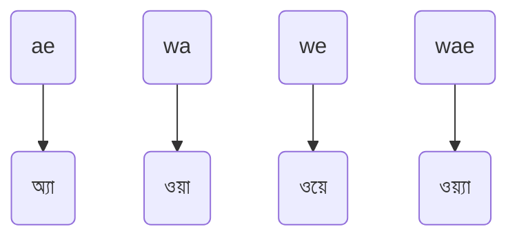

কিছু উদাহরণ:
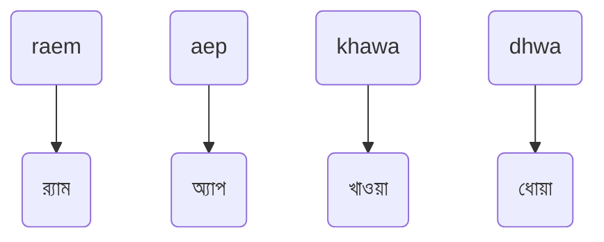

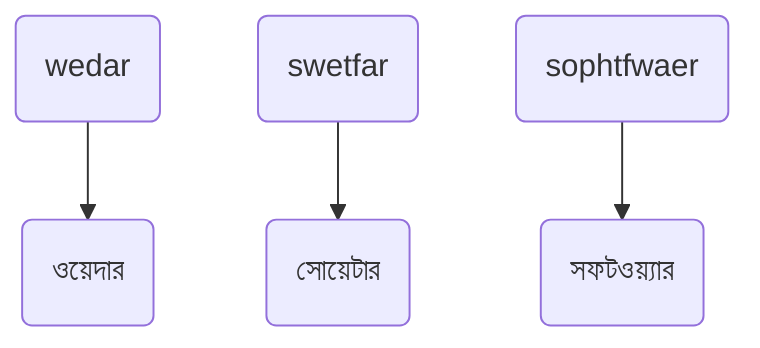

## ধাপ ৪: স্বরবর্ণের বদলে কারচিহ্ন, কিংবা কারচিহ্নের বদলে স্বরবর্ণ ফোর্স করা
এটা ক্ষিপ্র-র অন্যতম প্রধান আকর্ষণ। *[মডিফায়ার](#মডিফায়ার)* ব্যবহার করে স্বরবর্ণ ⇔ স্বরচিহ্ন পারস্পরিক রূপান্তর করা যায়। যেমন:

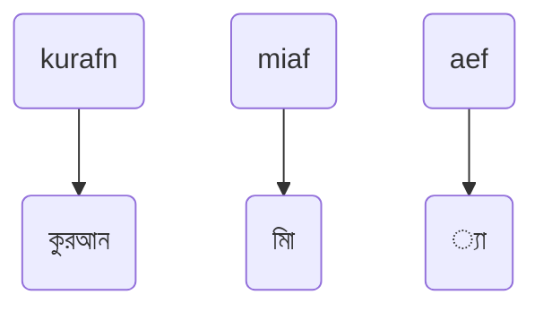

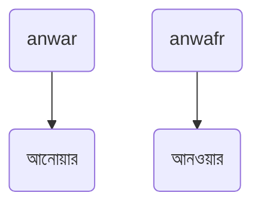

> [!NOTE]
> এভাবে ক্ষিপ্র-তে সম্ভব, অসম্ভব যেকোনো বানান লেখা যায়।


যেহেতু `wi` = `ঐ` এবং `wu` = `ঔ` এজন্য সেসব ক্ষেত্রে `f` তথা ([মডিফায়ার](#মডিফায়ার)) দিয়ে `ই` এবং `উ` তৈরি হবে।

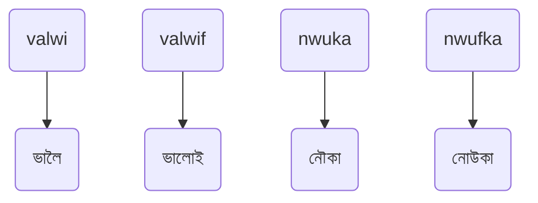

> [!NOTE]
> [পৃথায়ক](#পৃথায়ক) ব্যবহার করেও এই কাজ করা যেত। যেমন: `valw;i` = `ভালোই`  
> পৃথায়ক সম্পর্কে [নিচে](#পৃথায়ক) লেখা হয়েছে।

## ধাপ ৫: অন্যান্য ব্যঞ্জনবর্ণ লেখা

### ধাপ ৫.১: খ, ঘ, ছ, ঝ, ইত্যাদি মহাপ্রাণ বর্ণ লেখা
নিচের সাতটি মহাপ্রাণ বর্ণ লেখার জন্য h ব্যবহার করতে হবে:

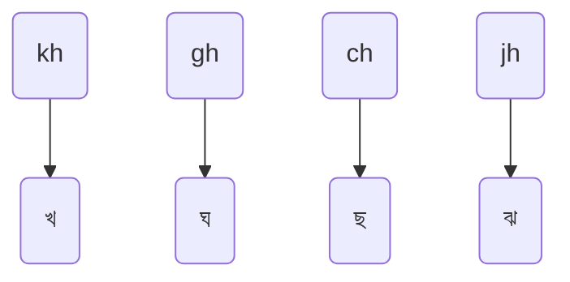

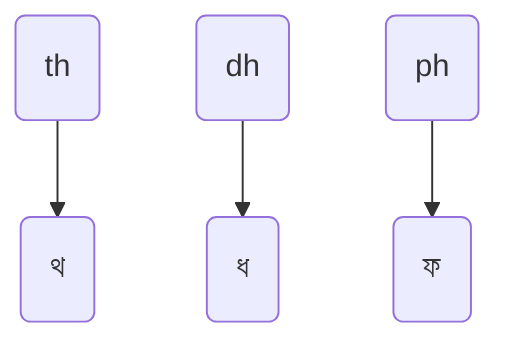

> [!NOTE]
> ভ, শ, ঠ, ঢ, ঢ় ইত্যাদি বর্ণ `h` যোগে লেখা যাবে না। এগুলো লেখা আমরা পরবর্তী ধাপে শিখব।

### ধাপ ৫.২: ভ লেখা
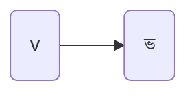

> [!IMPORTANT]
> `ভ` কেবল `v` দিয়ে লেখা যাবে, `bh` দিয়ে নয়। যেমন: `abhawa` = `আবহাওয়া`।\
`ফ` কেবল `ph` দিয়ে লেখা যাবে, `f` দিয়ে নয়। কেননা `f` *মডিফায়ার* key. 

### ধাপ ৫.৩: শ লেখা
`শ` যদিও মহাপ্রাণ বর্ণ নয়, তবুও `sh` দিয়ে `শ` লেখা যাবে।
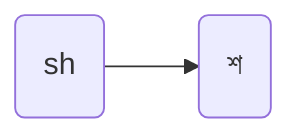

<a id="মডিফায়ার"></a>

## ধাপ ৬: *মডিফায়ার* পরিচিতি
ক্ষিপ্র-তে `f` key কে *মডিফায়ার* হিসেবে রাখা হয়েছে। কিছু কিছু বর্ণের পরে `f` লিখে সেগুলোকে মডিফাই করা যাবে।\
*মডিফায়ার* ক্ষিপ্র-র একটি শক্তিশালী ফিচার। সামনে মডিফায়ারের অনেক গুলো উপযোগীতা ও উপকারীতা দেখতে পাবো আমরা।

<a id="পৃথায়ক"></a>

## ধাপ ৭: *পৃথায়ক* পরিচিতি
*পৃথায়ক* ক্ষিপ্র-র অন্যতম শক্তিশালী একটি ফিচার। *পৃথায়ক* ব্যবহার করে আপনার লেখাকে যেকোনো জায়গায় বিচ্ছিন্ন বা অংশায়িত করা যায়। এটার অসংখ্য ব্যবহার রয়েছে।
সেমিকোলন `;` -কে ক্ষিপ্রতে *পৃথায়ক* হিসেবে ব্যবহার করা হয়।
উদাহরণের মাধ্যমে বিষয়টি তুলে ধরা হলো:

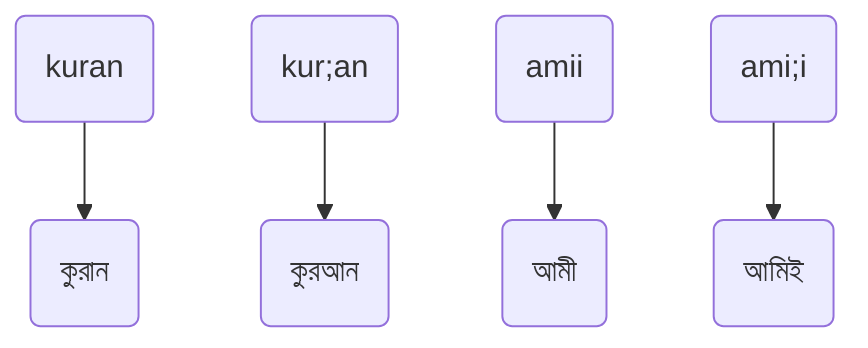

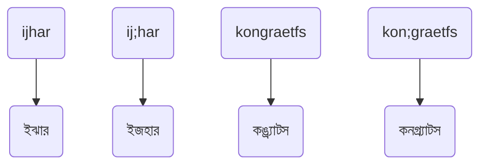

> [!NOTE]
> সেমিকোলন `;` যেহেতু *পৃথায়ক*, তাই শব্দের মাঝে সেমিকোলন লিখতে পরপর দুবার সেমিকোলন চাপুন।

যেমন:

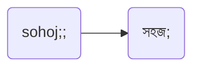

*পৃথায়ক* নিয়ে বিস্তারিত ও পূর্ণাঙ্গ আলোচনা আমাদের পূর্ণাঙ্গ ডকুমেন্টেশনে করা হবে। পড়তে ক্লিক করুন।

## ধাপ ৫: (বাকি অংশ)
### ধাপ ৫.৪: ট, ঠ, ড, ঢ, ণ, ষ, ড়, ঢ়, ইত্যাদি বর্ণ লেখা
* ত -এর পরে *মডিফায়ার* (`f`) ব্যবহার করে ট, ঠ;
* দ -এর পরে `f` ব্যবহার করে ড, ঢ;
* ন -এর পরে `f` দিয়ে ণ;
* স -এর পরে `f` দিয়ে ষ;
* এবং, র -এর পরে `f` দিয়ে ড়, ঢ় লেখা যাবে।  

অর্থাৎ, একবার কিংবা দুইবার `f` ব্যবহার করে লেখা যাবে নিচের মতো:

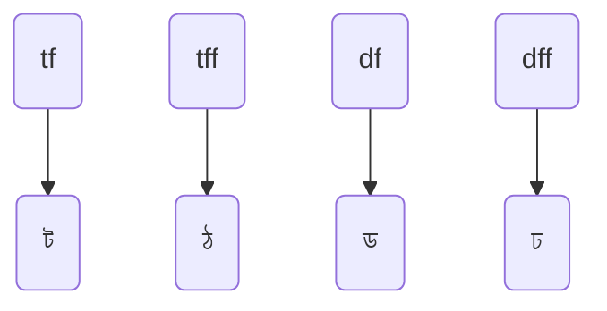

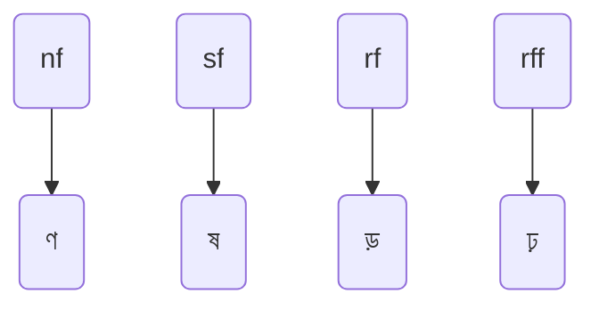

### ধাপ ৫.৫: ক্ষ লেখা
`ক্ষ` যুক্তবর্ণ (ক্ষ = ক + ষ = `k` + `sf`) হলেও এটা লেখার দুটো শর্টকাট আছে: `kf`, ও `kkh`

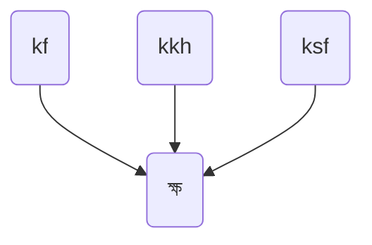

ক্ষ নিয়ে পূর্ণাঙ্গ আলোচনা আমাদের পূর্ণাঙ্গ ডকুমেন্টেশনে করা হয়েছে। (ক্লিক করুন)


### ধাপ ৫.৬: ঞ লেখা
`ঞ` লেখার জন্য প্রায় সর্বদাই `n` দিয়েই কাজ চলে যাবে। কেননা ঞ যুক্তবর্ণরূপে ছাড়া দেখা যায় না বললেই চলে।
তবুও মুক্ত রূপে ঞ লেখার জন্য `nff` ম্যাপিং রয়েছে।

```mermaid
flowchart TD
a(nj) --> b(ঞ্জ)
e(nc) --> f(ঞ্চ)
c(nff) --> d(ঞ)
```

### ধাপ ৫.৭: অনুস্বার ` ং` লেখা
`x` দিয়ে `ং` লিখতে হবে। 
এটি ব্যতিক্রমী হলেও এতে বেশ কিছু শব্দ লিখতে সুবিধা হবে। যেমন:

```mermaid
flowchart TD
a(oxk) --> e(অংক)
b(ongk) --> f(অঙ্ক)
c(lixk) --> g(লিংক)
d(lingk) --> h(লিঙ্ক)
```

> [!NOTE]
> এতে `ং` এবং `ঙ` এর মধ্যে পার্থক্য করা সহজ হবে।

এ বিষয়ে বিস্তারিত পড়ুন আমাদের পূর্ণাঙ্গ ডকুমেন্টেশনে। পড়তে ক্লিক করুন।

### ধাপ ৫.৮: বিসর্গ `ঃ` লেখা
বিসর্গ লেখার জন্য `oo` ব্যবহার করতে হবে।

```mermaid
flowchart TD
a(duookh) --> b(দুঃখ)
c(uoo) --> d(উঃ)
```

### ধাপ ৫.৯: চন্দ্রবিন্দু `ঁ` লেখা
চন্দ্রবিন্দু লেখার জন্য স্বরধ্বনির পরে স্ল্যাশ `/` ব্যবহার করতে হবে।

```mermaid
flowchart TD
a(po/ca) --> b(পঁচা)
c(ae/h) --> d(অ্যাঁহ)
```

কোথাও স্বাধীনভাবে চন্দ্রবিন্দু insert করতে `//` দিতে হবে:

```mermaid
flowchart TD
a(//) --> b( -ঁ )
```


## ধাপ ৮: যুক্তবর্ণ লেখা কিংবা এড়িয়ে যাওয়া
1. যুক্তবর্ণ গঠন সম্ভব এমন একাধিক বর্ণ একসাথে টাইপ করলে যুক্তবর্ণ হবে।\
যেমন:

```mermaid
flowchart TD
A(kt) --> B("ক্ত")
c(kr) --> d("ক্র")
```

2. যুক্তবর্ণ এড়াতে বর্ণের মাঝে *পৃথায়ক* ব্যবহার করুন। ক্ষিপ্রতে সেমিকোলন `;` হলো *পৃথায়ক।*\
যেমন:  
```mermaid
flowchart TD
c(k;r) --> d("কর")
e(k;t) --> f("কত")
```

3. পৃথায়কের পরিবর্তে `o` ব্যবহার করেও যুক্তবর্ণ এড়ানো যায়।\
যেমন:
```mermaid
flowchart LR

c(kor) --> d("কর")
e(kot) --> f("কত")
```

### ধাপ ৮.২: স্ল্যাশ `/` -এর ব্যবহার (*স্লাইসার* হিসেবে) (যুক্তবর্ণ সংক্রান্ত)
পূর্বে উল্লেখিত মডিফায়ারের মতো `/` key -কেও ক্ষিপ্রতে *মডিফায়ার* হিসেবে রাখা হয়েছে। নাম দেওয়া হয়েছে '*স্লাইসার*'।

লিখতে গিয়ে চলে আসা অবাঞ্ছিত যুক্তবর্ণ দূরীকরণের জন্য স্ল্যাশ ব্যবহার করা যাবে।\
যেমন:\
`বাকরুদ্ধ` লেখার জন্য কেউ `bakruddh` লিখলে `বাক্রুদ্ধ` আসবে। এখানে `ক্র` চলে আসার পরে যদি `/` দিয়ে দেওয়া হয় তাহলে ব্যাকস্পেস না চেপেই সেটাকে ভেঙে ফেলা যাবে। `bakr/uddh` = `বাকরুদ্ধ` উদাহরণ:

```mermaid
flowchart TD
a(alp/ona) --> b(আলপনা)
e(lagb/e) --> f(লাগবে)
z(aelg/oridom) --> g(অ্যালগরিদম)
```

এ বিষয়ে পূর্ণাঙ্গ আলোচনা আমাদের পূর্ণাঙ্গ ডকুমেন্টেশনে করা হয়েছে। এ বিষয়ে বাকিটা জানতে ক্লিক করুন।

> [!NOTE]
> বর্ণদ্বয়ের মাঝে *পৃথায়ক* ব্যবহার করেও এই কাজ করা যেত। যেমন: `k;r` = `কর`. কিন্তু এই ফিচারটা আনা হয়েছেই সেসব ক্ষেত্রের জন্য যখন কেউ লেখার সময় *পৃথায়ক* দিতে ভুলে যাবেন।\
সেক্ষেত্রে তাঁকে ব্যাকস্পেস দিয়ে মুছে আবার লিখতে হবে না।


## ক্ষিপ্র ইনস্টল করা
লিনাক্স, উইন্ডোজ, কিংবা অ্যান্ড্রয়েডে ক্ষিপ্র ইনস্টল করার নির্দেশনা দেখতে ক্ষিপ্র-র [ইনস্টলেশন পেজ](https://khipro.khiproteam.com/#installation) ভিসিট করুন।
